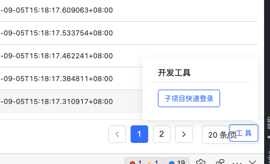

# Lava开发工具组件



## 使用方法

在```App.vue```里添加```lava-dev-tools```。

这个组件会自动判断当前NODE_ENV，如果是production环境不会渲染。所以不用考虑环境问题。

```html
<template>
  <a-config-provider :locale="zhCN" :prefixCls="modifyVars['@ant-prefix']">
    <router-view></router-view>
    <lava-dev-tools />
  </a-config-provider>
</template>
```

## 功能列表

- 子项目快速登录：在单独启动非lava-fe-common子项目时提供一个登录入口

## 开发新功能

在```smart-ui-vue/lava/LavaDevtools```下添加新的组件。
